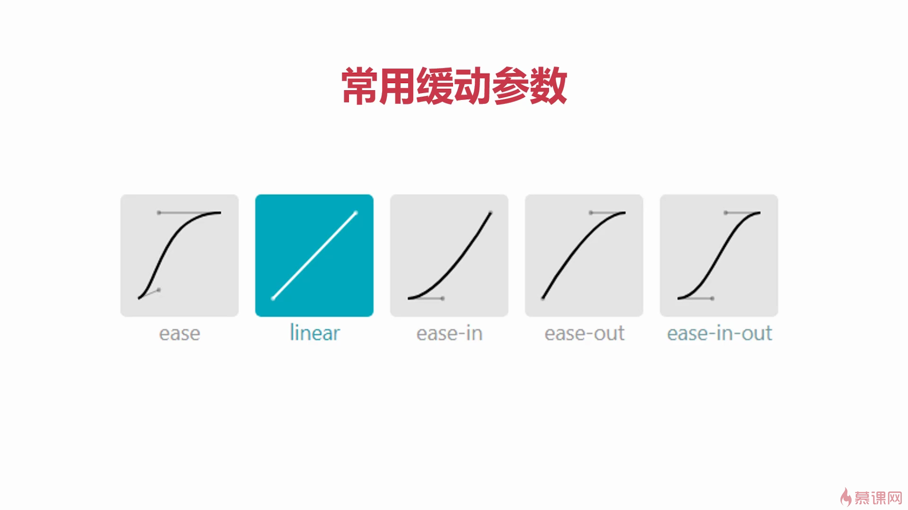

# 1.1.9 过渡和动画

## (CSS3)过渡trasition

过渡可为一个元素在不同**样式**之间**变化**自动添加**补间动画**。比起JS定时器动画，过渡动画细腻，内存开销小。

### 使用

#### 四要素

```
trasition:  width   1s  linear  0s;
什么属性要过渡 动画时长 变化速度曲线 延迟触发曲线
```

#### 属性

- 所有**数值类型**的属性均可参与过渡，如`width`/`height`/`left`/`top`/`border-radius`等。
- **颜色**都可过渡。
- 所有**变形（包括2D与3D）**都可被过渡。

>从**开始状态**处定义过渡

```css
.box{
    height:200px;
    width:200px;
    transition:width 5s linear 0s
}
.box{
    width:800px
}
```

以上代码的效果为box在鼠标进入时过渡边宽至800px，**鼠标离开时又过渡回200px**。

### 过渡背景颜色

直接将过渡属性改为对应color属性即可。

### all

如果要所有属性都参与过渡，可以写all。

```
trasition:all 1s linear 0s;
```

>有效率问题，不可滥用。

### 四个小属性

小属性|含义
-|-
trasition-proporty|哪些属性要过渡
trasition-duration|动画时间
trasition-timing-function|动画变化曲线
trasition-delay|延迟时间

### 缓动参数



常用参数|速度
-|-
ease|慢-快-慢
linear|匀速
ease-in|慢-快
ease-out|快-慢
ease-in-out|慢-快-慢（平缓）

#### 贝塞尔曲线

[https://cubic-bezier.com](https://cubic-bezier.com)可生成贝塞尔曲线，可自定义动画缓动参数。

```
trasition:width 1s cubic-bezier(0.1,0.7.1.0.0.1) 0s
```
#### 盒子浮现效果

原盒子`opacity`设为0，并设置过渡，:hover设为`opacity:1`。

## 动画

### 动画的定义

使用`@keyframes`来定义动画，keyframes表示关键帧，**项目上线前，要补上`@-webkit`这样的私有前缀**。

```css
/* 动画名为r */
@keyframes r{
    /* 起始状态 */
    from{ 
        transform:rotate(0);
    }
    /* 结束状态 */
    to{
        transform:rotate(360deg);
    }
}
```

### 动画的调用

定义动画后，就可以使用`animation`属性来调用动画。

```
四个值为动画名、总时长、缓动效果、延迟
animation:r 1s linear 0s;
animation:r 1s linear 0s 3;
                        执行次数
```
- 若想永远执行，执行次数参数可写`infinite`。
- 若想让动画的第2、4、6（偶数）自动**逆向执行**，那么加上`alternate`即可。
    ```
    animation:r 1s linear 0s infinite alternate;
    ```
- 若想让动画停在最后的结束状态，那么要加上`forwards`
    ```
    animation:r 1s linear 0s forwards;
    ```

### 多关键帧动画

```css
@keyframes changeColor{
    /* 动画执行时间,用%进度表示 */
    0%{
        background-color:red;
    }
    20%{
        background-color:yellow;
    }
    40%{
        background-color:blue;
    }
    ......
    100%{
        background-color:orange;
    }
}
```