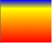
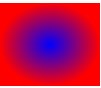

# 背景图片

## 背景图片 background-image

图片路径要写到**url()**中，可以是相对路径，也可以是http绝对路径。

>如果样式表是外链的，那么要书写**css出发到图片的路径**，而不是从html出发。

## 重复模式

值|意义
-|-
repeat|x,y均平铺（默认）
repeat-x|x平铺
repeat-y|y平铺
no-repeat|不平铺

## background 综合属性

可同时添加**背景颜色**与**背景图片**。

>**当背景图片有透明区域时可用此属性进行填充**。

```
background:white url(images/xxx.png);
```

## （CSS3）背景尺寸 background-size

设置背景图片的尺寸，兼容到IE9，之前的属性兼容到IE6。

```
background-size:宽  高
background-size:100px 200px
```

值也可以用**百分数**设置，表示**盒子宽高的百分之多少**。徐等比例设置的值可用`auto`。

```
background-size:300px auto
```

将背景图片宽度设置为300px，**高度自动缩放**。

```
background-size:50% auto
```

将背景图片**宽度设为盒子的一半**，高度自动缩放。

### contain和cover

`contain`和`cover`是两个特殊的`background-size`值。

- `contain`表示将背景图片智能改变尺寸以**容纳到盒子里**。**（优先完整显示图片）**
- `cover`表示将背景图片智能改变尺寸以**撑满盒子**。**（优先覆盖盒子）**

## （CSS3）背景裁切 background-clip

设置元素背景裁切到**盒子的哪个范围**，兼容到IE9。

值|意义
-|-
border-box|背景延伸至边框（默认值）
padding-box|背景延伸至内边（padding）不绘制到边框（仅在dotted、dashed边框可察觉
content-box|背景被裁切至内容区

>可与背景起源`background-origin`混用，设置图片从哪**开始**渲染，其值与`background-clip`值类似。

## 背景固定 background-attachment

当且仅当**子元素与父元素均存在滚动条时有效**。决定背景图片的位置是视口内固定，或者随着包含它的区块滚动。

值|含义
-|-
fixed|背景图片固定在父元素中，滚动子元素背景图片不会移动，滚动父元素图片会相对子元素移动。
local|背景图片固定在子元素中，滚动子元素背景图片移动，滚动父元素背景图片会随着子元素的移动而移动。
scroll|背景图片不固定，滚动子元素背景图片不移动，滚动父元素背景图片会随着子元素的移动而移动。

## 背景位置 background-position

可设置背景图片出现在盒子的什么位置。

```
background-position:距左  据右
background-position:100px 200px
```

可以用`top`,`bottom`,`center`,`left`,`right`描述图片出现的位置。

```
background-position:center bottom
或者background-position:bottom center效果相同
```

## CSS精灵

将多个小图标**合并只做到一张图片上**，使用`background-postion`属性单独显示其中一个，这样的技术叫做css精灵技术，也叫做雪碧图。

>使用PS**裁切工具**确定图片位置，设置position为PS显示位置的**负数**。

**优势**

可以减少http请求数，加快网页显示速度。

**劣势**

不方便测量，后期改动麻烦。

## background 综合属性

常用背景相关小属性可合写

```
background:背景颜色 背景图片   北京重复  背景位置
background:white url(xxx.png) no-repeat center center
```

## 线性渐变

盒子的`background-image`属性可以用`linear-gradient()`形式创建线性渐变背景。

```
linear-gradient(to 渐变方向,开始色,结束色)
background-image:linear-gradient(to right,blue,red);
```

渐变的方向亦可写成度数：

```
background-image:linear-gradient(45deg,blue,red);
```

可以有**多个颜色**的值，并可以用**百分数定义它们出现的位置**。

```
background-image:linear-gradient(to bottom,blue,yellow 20%,red);
```

**实现效果**：



## 浏览器私有前缀

不同浏览器有不同的私有前缀，用来对**实验性质的css属性**加以标识。

品牌|前缀
-|-
Google Chrome、Apple Sarfari|-webkit-
Mozilla Firefox|-moz-
Microsoft IE/Edge|-ms-
Opera|-o-

通过给曾经是实验属性的属性添加私有前缀可以提高网页的**向前兼容性**。

如：

```
background-image:-webkit-linear-gradient(to right,blue,red)
```

>后期使用前端脚手架后可以自动添加，无需一个一个改动。

## 径向渐变

盒子的`background-image`属性可以用`radial-gradient()`形式创建线性渐变背景。

```
radial-gradient(圆心位置,开始色,结束色)
background-image:radial-gradient(50% 50%,blue,red);
```

也可以定义多个颜色，具体使用方法与线性渐变相同。

**实现效果**：


